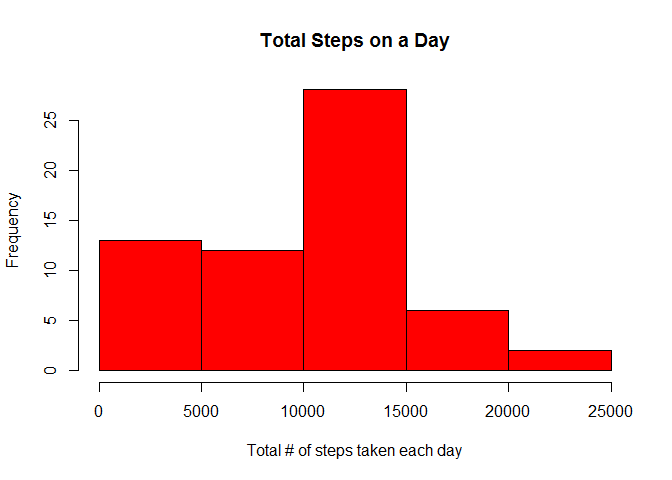
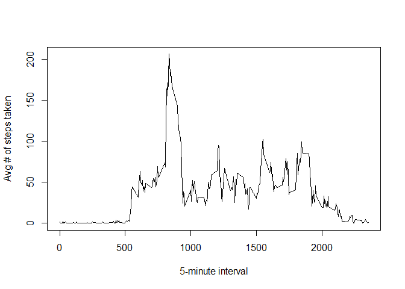
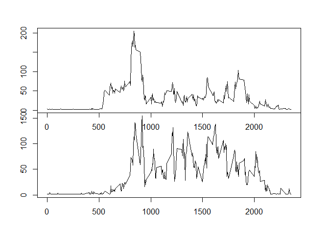

# Reproducible Research: Peer Assessment 1
Prabin Shakya  


***************************************************


```r
# Include
library(dplyr)
```

```
## 
## Attaching package: 'dplyr'
```

```
## The following objects are masked from 'package:stats':
## 
##     filter, lag
```

```
## The following objects are masked from 'package:base':
## 
##     intersect, setdiff, setequal, union
```


## Loading and preprocessing the data
  

#### 1. Load the data (i.e. read.csv())


```r
data<-read.csv("activity.csv")
```


#### 2. Process/transform the data (if necessary) into a format suitable for your analysis


```r
data$date<-as.Date(data$date)

head(data)
```

```
##   steps       date interval
## 1    NA 2012-10-01        0
## 2    NA 2012-10-01        5
## 3    NA 2012-10-01       10
## 4    NA 2012-10-01       15
## 5    NA 2012-10-01       20
## 6    NA 2012-10-01       25
```

***************************************************

## What is mean total number of steps taken per day?

For this part of the assignment, you can ignore the missing values in the dataset.

#### 1. Make a histogram of the total number of steps taken each day


Answer: Below is the histogram of the total number of steps taken each day.


```r
dataAgr_Day_Total <- aggregate(data$steps
                     ,by=list(date = data$date)
                     ,sum,na.rm=TRUE)

hist(dataAgr_Day_Total$x,col = "Red"
     ,xlab = "Total # of steps taken each day"
     ,main = "Total Steps on a Day"
     )
```

<!-- -->


***************************************************

#### 2. Calculate and report the mean and median total number of steps taken per day

Answer:


```r
dataAvg_mean<-as.integer(mean(dataAgr_Day_Total$x))
dataAvg_median<-as.integer(median(dataAgr_Day_Total$x))
```


Mean and median of the total number of steps taken per day is 9354 and 10395 respectively.

***************************************************


## What is the average daily activity pattern?


#### 1. Make a time series plot (i.e. type = "l") of the 5-minute interval (x-axis) and the average number 
#### of steps taken, averaged across all days (y-axis)

Answer:


```r
dataAgr_Day_Mean <- aggregate(data$steps
                     ,by=list(interval = data$interval)
                     ,mean,na.rm=TRUE)

plot(dataAgr_Day_Mean$interval
     ,dataAgr_Day_Mean$x
     ,type = "l"
     ,xlab = "5-minute interval"
     ,ylab = "Avg # of steps taken"
     )
```

<!-- -->

#### 2. Which 5-minute interval, on average across all the days in the dataset, contains the maximum number of steps?

Answer:


```r
dataAvg_max <- max(dataAgr_Day_Mean$x)
maxRecord <- dataAgr_Day_Mean[dataAgr_Day_Mean$x == dataAvg_max,]
```
The maximum number of steps of 206.1698113 occurs in the interval of 835


***************************************************

## Imputing missing values

Note that there are a number of days/intervals where there are missing values (coded as NA). 
The presence of missing days may introduce bias into some calculations or summaries of the data.

#### 1. Calculate and report the total number of missing values in the dataset (i.e. the total number of rows with NAs)

Answer:


```r
totalNAs <- nrow(data[data$steps == "NA",])
```

There are 2304 number rows with NAs in this data.


#### 2. Devise a strategy for filling in all of the missing values in the dataset. The strategy does not need
#### to be sophisticated. For example, you could use the mean/median for that day, or the mean for 
#### that 5-minute interval, etc.

Answer:


```r
#This function will return a default of 10 steps if the value is blank.

checkValue<-function(steps){
  
  
  if (is.na(steps)) {
    return (10)
  }
  
  return (steps)  
  
}
```

#### 3. Create a new dataset that is equal to the original dataset but with the missing data filled in.

Answer:


```r
# Copy of original data set
dataRevised<- data

# replace NA with defaul value
for(i in 1:nrow(dataRevised)){
  dataRevised[i,"steps"]<-checkValue(dataRevised[i,"steps"])
}
```

#### 4. Make a histogram of the total number of steps taken each day and Calculate and report the mean 
#### and median total number of steps taken per day. Do these values differ from the estimates from the 
#### first part of the assignment? What is the impact of imputing missing data on the estimates of 
#### the total daily number of steps?

Answer:


```r
dataRevisedAgr_Day_Total <- aggregate(dataRevised$steps
                     ,by=list(date = data$date)
                     ,sum,na.rm=TRUE)

hist(dataRevisedAgr_Day_Total$x
     ,col = "Red"
     ,xlab = "Total # of steps taken each day"
     ,main = "Total Steps on a Day")
```

<!-- -->

```r
meanRevised<-as.integer(mean(dataRevisedAgr_Day_Total$x))
medianRevised<-as.integer(median(dataRevisedAgr_Day_Total$x))
```

Revised Mean and median of the total number of steps taken per day is 9731 and 10395 respectively. 

Impact:
- Mean has shifted
- Medain remains the same
- Minimal impact to histogram


***************************************************

## Are there differences in activity patterns between weekdays and weekends?

For this part the weekdays() function may be of some help here. 
Use the dataset with the filled-in missing values for this part.

#### 1. Create a new factor variable in the dataset with two levels -- "weekday" and "weekend" indicating 
#### whether a given date is a weekday or weekend day.

Answer:


```r
# add fields day and dayType to the revised data set
dataRevised <- mutate(dataRevised,day = weekdays(dataRevised$date)) 
dataRevised <- mutate(dataRevised
                ,dayType = ifelse(dataRevised$day %in% c("Saturday","Sunday"), "Weekend", "Weekday")) 
```


#### 2. Make a panel plot containing a time series plot (i.e. type = "l") of the 5-minute interval (x-axis) 
#### and the average number of steps taken, averaged across all weekday days or weekend days (y-axis). 
#### The plot should look something like the following, which was created using simulated data:

Answer:


```r
dataRevised_Weekday <- dataRevised[dataRevised$dayType == "Weekday",]

dataRevised_Weekend <- dataRevised[dataRevised$dayType == "Weekend",]

dataRevised_Weekday_Agr <- aggregate(dataRevised_Weekday$steps
                     ,by=list(interval = dataRevised_Weekday$interval)
                     ,mean,na.rm=TRUE)

dataRevised_Weekend_Agr <- aggregate(dataRevised_Weekend$steps
                     ,by=list(interval = dataRevised_Weekend$interval)
                     ,mean,na.rm=TRUE)

par(mfrow = c(2,1),mar=rep(0,4), oma = c(4,4,3,3))

# Draw 1st plot
plot(dataRevised_Weekday_Agr$interval
     ,dataRevised_Weekday_Agr$x
     ,type = "l"
     ,xlab = "5-minute interval"
     ,ylab = "Avg # of steps (Weekday)")

# Draw 2nd Plot
plot(dataRevised_Weekend_Agr$interval
     ,dataRevised_Weekend_Agr$x
     ,type = "l"
     ,xlab = "5-minute interval"
     ,ylab = "Avg # of steps (Weekend)")
```

<!-- -->

***************************************************
